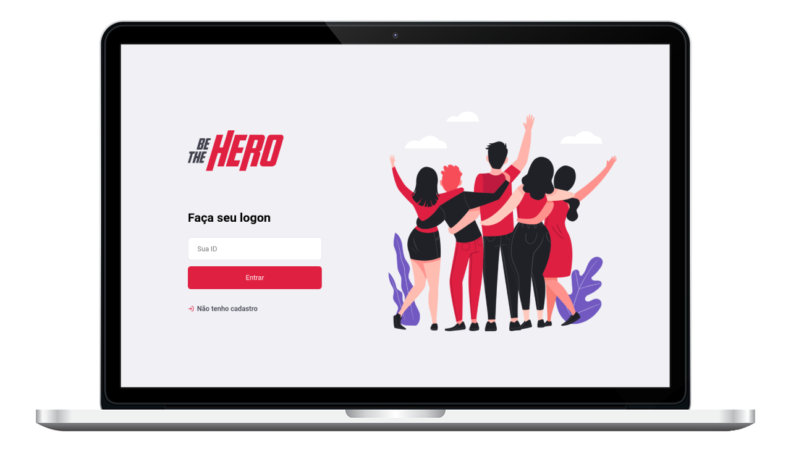
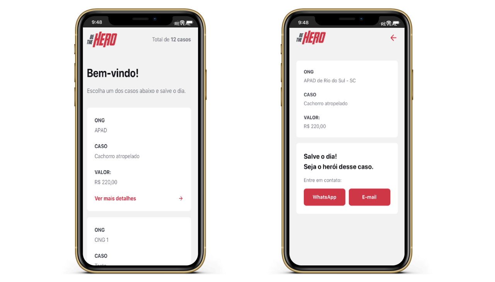

<h1 align="center">
  
</h1>

<h4 align="center">
  Aplicação desenvolvida durante a Semana OmniStack 11
</h4>

  <a href="#Tecnologias">Tecnologias</a>&nbsp;&nbsp;|&nbsp;
  <a href="#Projeto">Projeto</a>&nbsp;&nbsp;|&nbsp;
  <a href="#Layout">Layout</a>&nbsp;&nbsp;|&nbsp;
  <a href="#detalhes"> Detalhes</a>&nbsp;&nbsp;|&nbsp;
  <a href="#Licença">Licença</a>

 

  

  

## **Tecnologias**

Este projeto foi desenvolvido com as seguintes tecnologias:

- [Node.js](https://nodejs.org/en/)
- [React](https://reactjs.org)
- [React Native](https://facebook.github.io/react-native/)

Mais detalhadamente podemos citar:

- [TypeScript](https://www.typescriptlang.org/)
- [Express](https://expressjs.com/)
- [Mongoose](https://mongoosejs.com/)
- [Socket.io](https://socket.io/)
- [Expo](https://expo.io/)

## **Projeto**

O Be The Hero é um projeto que visa conectar ONGs que necessitam de ajuda com pessoas que querem ajudar, que chamamos de heróis.

## **Layout**

Você pode baixar o layout do projeto no formato `.sketch` através [desse link](.github/bethehero.sketch).

Para abrir o arquivo no formato `.sketch` em qualquer sistema operacional utilize a ferramenta [Figma](https://figma.com).

## **Detalhes**

O projeto foi desenvolvido em basicamente 3 camadas principais que podem ser entendidos como projetos separados: Uma [api REST](api), uma [aplicação web](web) utilizando ReactJS e um [aplicativo mobile](mobile) utilizando React Native com Expo. Todos estes projetos foram escritos utilizando o NodeJS na versão 12.16.1 e Yarn na versão 1.21.1.

### Api

Para rodar a api é necessário, após clonar este repositório, entrar na pasta `api` com o terminal e realizar os seguintes passos:

1. Instalar as dependências: `yarn install`
2. Realizar a migration para criação do banco: `yarn knex:ts migrate:latest`
3. Rodar a aplicação em desenvolvimento: `yarn start`

<small>Para produção deverá realizar o build antes: `yarn build`. E configurar um banco de produção para não utilizar o SQLite.</small>

### Web

Esta aplicação foi a única utilizando JavaScript puro ao invés de TypeScript. Entre na pasta `web` no seu terminal e siga os seguintes passos:

1. Instalar as dependências: `yarn install`
2. Inicie a aplicação em desenvolvimento: `yarn start`

<small>Para produção deverá executar antes: `yarn build`. E rodar um servidor de arquivos estáticos servindo os arquivos gerados na pasta build.</small>

### Mobile

Entre na pasta `mobile` no terminal e execute os passos:

1. Instalar as dependências: `yarn install`
2. Inicie o servidor do expo: `yarn start`
3. O Expo irá abrir uma página no seu navegador onde você poderá escanear o QRCode fornecido em um celular Android ou iOS que tenha o aplicativo do Expo instalado, ou simplesmente rodar um emulador (Android ou iOS) e clicar para abrir a aplicação no seu respectivo emulador.

<small>Para produção é necessário seguir os passos do Expo para gerar um apk ou ipa.</small>

## Licença

Esse projeto está sob a licença MIT. Veja o arquivo [LICENSE](LICENSE.md) para mais detalhes.

---

Feito com ♥ estudando com a <a href="http://rocketseat.com.br">Rocketseat</a> 🚀

